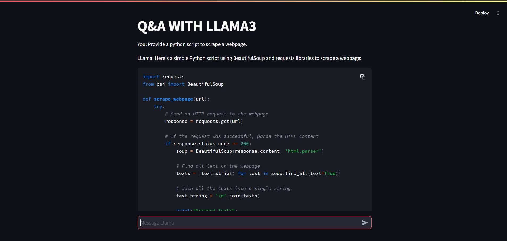
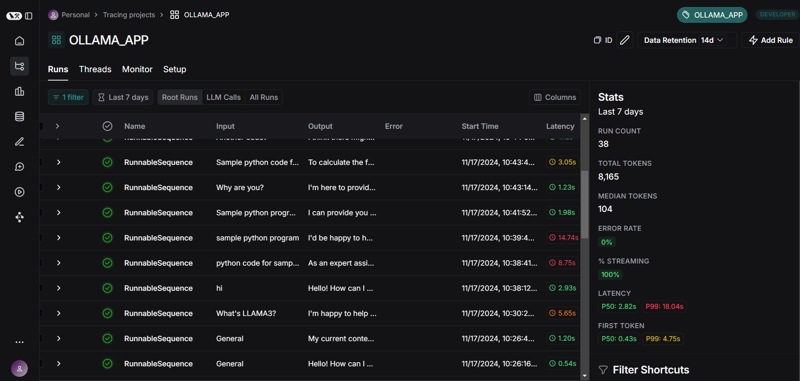

# Q&A WITH LLAMA3

## DESCRIPTION

This Q&A application leverages the `Ollama` language model (LLAMA 3.2:1b) to provide intelligent responses to user queries.

## TOOLS AND MODELS

- **LANGCHAIN**
- **OllamaLLM**
- **STREAMLIT**

## MODEL INSTALLATION

Download and install [`Ollama`](https://ollama.com/download). Then pull the required model as follows:
```bash
ollama run llama3.2:1b
```
Ollama has to be running locally for this app to work.

## GENERATING API KEYS

Generate API key for Langsmith to get an interactive tracking of your requests to LLM via langchain [`here`](https://smith.langchain.com/settings).

Refer sample .env in project's root directory.

## INSTALLING REQUIREMENTS
```bash
pip install -r requirements.txt
```

## RUNNING THE APPLICATION
```bash
streamlit run app.py
```

#### Navigate to [`localhost`](http://localhost:8501) to interact with LLAMA3.

<div class="row">
    
</div>

<div class="row">
    
</div>
